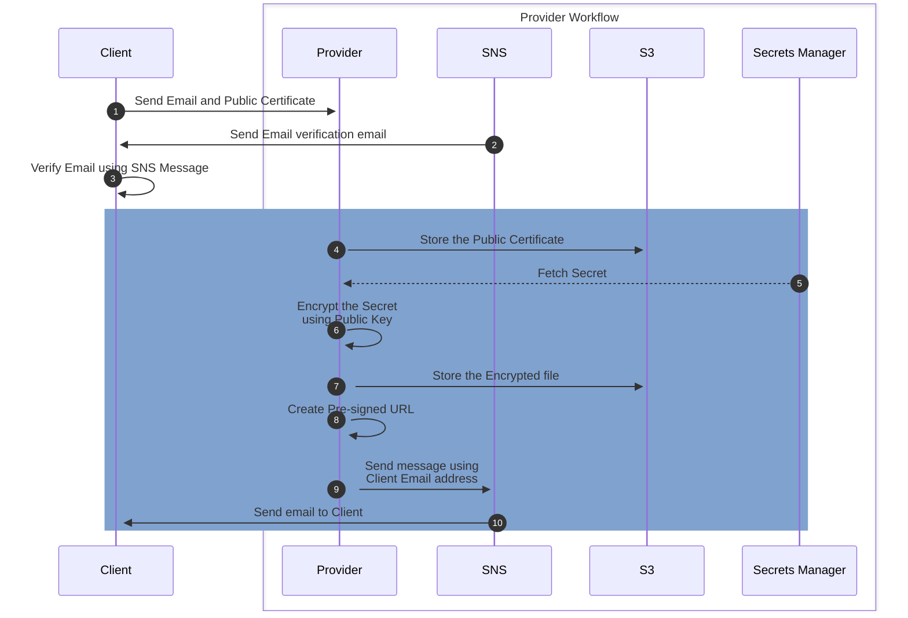
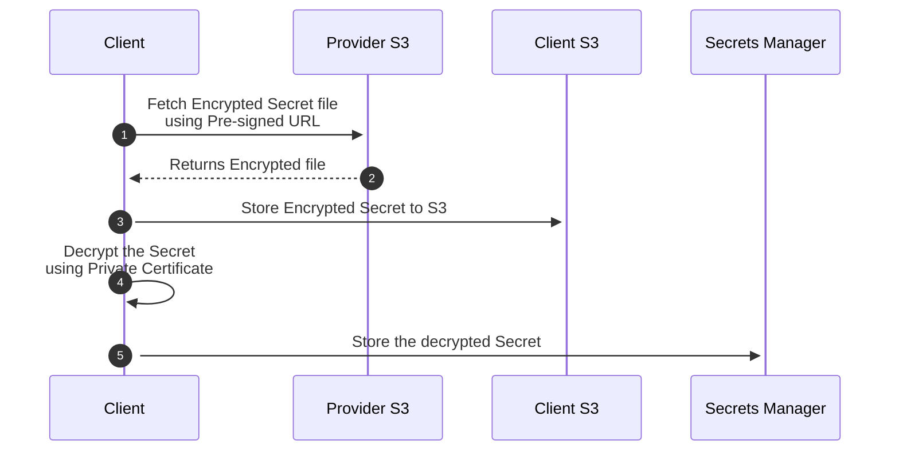

# Securely Transfer Secrets to your Clients
In this example, we create workflows to securely transfer secrets between clients.  The [AWS Secrets Manager cross-account access](https://docs.aws.amazon.com/secretsmanager/latest/userguide/auth-and-access_examples_cross.html) to share secrets between clients is a better approach.  However, in certain cases this may not possible when you have many clients that you will have to configure separately.  

This application securely shares secrets using elaborate workflows for both clients.

## Sequence Diagrams
**Sending Application Workflow**

* Ask the Client to share their RSA Public Certificate
* Create Secret for Client
* Encrypt the Secret with Client's Public Certificate
* Save the encrypted secret in S3 bucket
* Presign the URL for Client Download
* Send a SNS message to Client which will email them the S3 presigned URL link.

**Receiving Application Workflow**

* Download the S3 file using the Presign URL
* Decrypt the file content using the RSA Private Certificate
* Store the decrypted Secret in AWS Secret Manager

This application is developed using AWS CDK in TypeScript.

## What does this build?
* Creates a S3 bucket for holding the certificates
* Creates a lambda that performs the Sender workflow
* Creates another lambda that performs the receiver workflow
* Creates an API Gateway endpoint for the receiver lambda invocation in this example
  * You may want to create automation to invoke the lambda. One example can be to write the file to S3 and have S3 event invoke the lambda

## Steps to run and test
* Run the CDK Code and wait for it to finish
* Check your email from AWS for SNS message Subscription verification
    * 
* Accept and approve the confirmation
* Create the RSA Private and Public Certificates
    * Generate the private key: `openssl genrsa -out client-one-private.pem 4096`
    * Generate the public key: `openssl rsa -in client-one-private.pem -out client-one-public.pem -pubout`
* Upload the Certificates to the S3 Bucket
* Check your email for AWS SNS message with S3 presigend URL.  The URL is valid for 30 minutes.
    * 
    * 
* Invoke the API Gateway endpoint for the new decrypted Secrets Manager entry to be created
* Verify that the new Secret is created
* 

## Considerations
* Rather that creating a new secret each time, *client* should update existing secrets. Remember, this may require an application reboot based on your usecase.
* I didn't include Secret Rotation workflow in this example. If you have secret rotations, you will need to automate the process to run from those events.
* There are many opportunities to simplify this solution
    * Perhaps use Step Functions for these workflows.

## References
* [OpenSSL](https://www.openssl.org/)
* [Node Crypto](https://nodejs.org/api/crypto.html)
* [Amazon Secrets Manager](https://aws.amazon.com/secrets-manager/)
* [Amazon Lambda](https://aws.amazon.com/lambda/)
* [Amazon S3](https://aws.amazon.com/s3/)
* [Amazon API Gateway](https://aws.amazon.com/api-gateway/)
